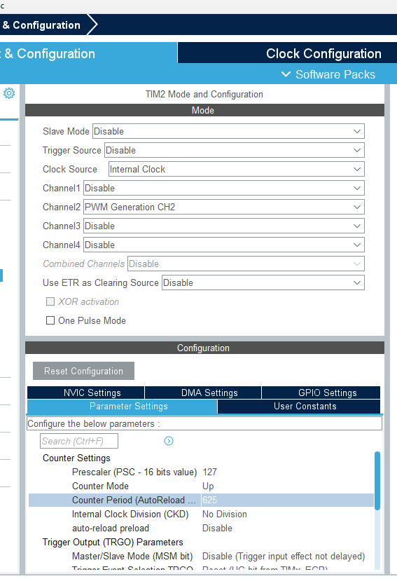
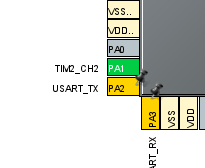
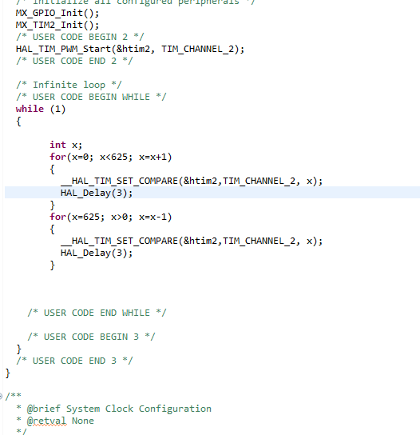

# L452_PWM
1. Click Timer → Click TIM2 →
2. Clock Source set to Internal Clock
3. Channel2 set to PWM Generation CH2
4. Configuration → Parameter Settings →
5. Prescaler set to 127
6. Counter Period 625 


 
7.  
``` /* USER CODE BEGIN 2 */
  HAL_TIM_PWM_Start(&htim2, TIM_CHANNEL_2);
  /* USER CODE END 2 */
```

8.   
```
while (1)
  {
	int x;
	for(x=0; x<625; x=x+1)
	{
	  __HAL_TIM_SET_COMPARE(&htim2,TIM_CHANNEL_2, x);
	  HAL_Delay(3);
	}
	for(x=625; x>0; x=x-1)
	{
	  __HAL_TIM_SET_COMPARE(&htim2,TIM_CHANNEL_2, x);
	  HAL_Delay(3);
	}
}	
  ```
